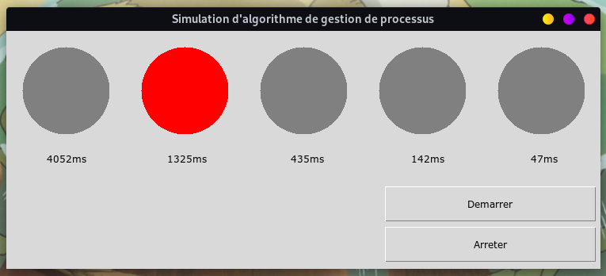
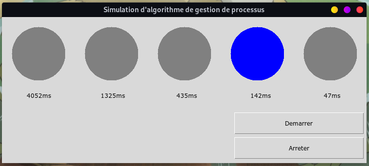

# Process Management Algorithm

My Operating System exam for the first semester of Info-Sec Masters 1 at USTHB. A processes managing algorithm with a Tkinter GUI.

## Requirements

- [Python version > 3](https://www.python.org/downloads/)
- [Tkinter](https://docs.python.org/3/library/tkinter.html)

## Setup

`$ python main.py`

## Screenshots

## Algorithm Instructions

We want to simulate the following process management algorithm:

- Each process has a priority value. We have 5 processes (white, red, green, blue, yellow) the priority value for the processes is 9548, 3121, 1024, 335, 110 respectively.

- Each process has a different quantum of allocated time depending on its priority.

`Quantum of the process (i)= latency * the priority of the process (i) / sum (of the priorities of all the processes)`

`The latency time is equal to 6 seconds.`

- At each clock tick (the clock tick is 1 second) the execution value is calculated for each process such as:

`Process execution value (i) = CPU time spent * 1024 / process priority (i).`

`The time spent in CPU is the total (sum) of the execution time of the process in CPU since the start of the application.`

- The elected process will be the process that has the lowest execution value, the latter will take the CPU during its own quantum.

- At the end of the quantum, a process will be elected (which has the smallest execution value) and will take the CPU during its own quantum.

- Initially the execution time of all the processes is 0s and therefore the elected process will be the first process to arrive.

## Interface Instructions

- Processes are simulated by the color assigned to each process. You have a choice of interface elements to display the color. A running process has an on color.

- Display time quantums for each process.

- A start button to launch the execution of the processes according to the described algorithm.

- A stop button to stop the algorithm.
